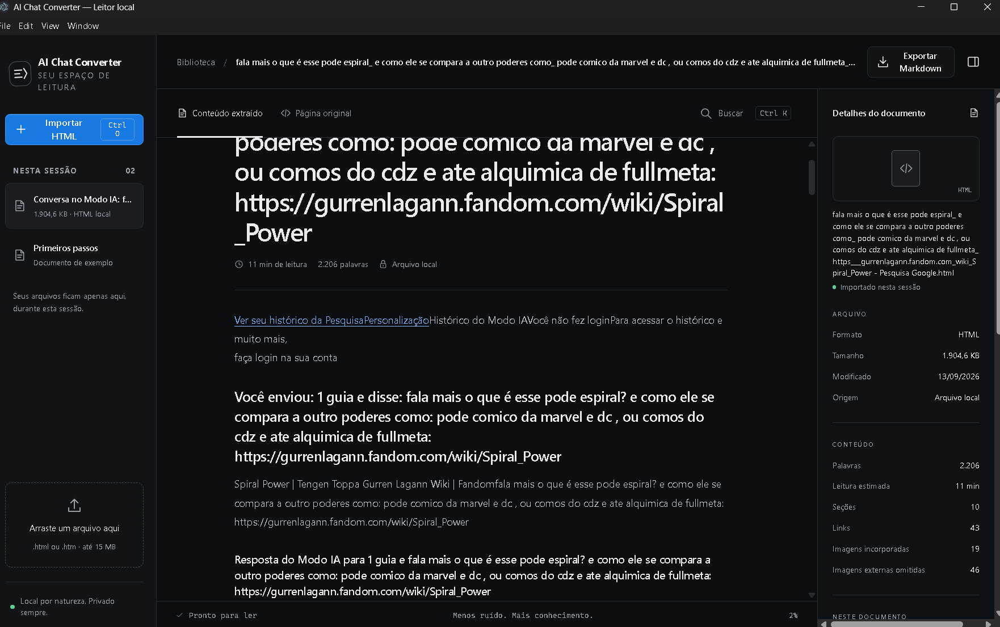

# AI Chat Converter

Aplicativo desktop para converter páginas HTML salvas de chats de IA em Markdown limpo e estruturado. A interface React/Electron usa um motor Python local para identificar, limpar e organizar as mensagens da conversa.

## Recursos

- Conversão de arquivos HTML de ChatGPT, Google AI Mode e páginas genéricas.
- Extração semântica de parágrafos, listas, tabelas, citações e blocos de código.
- Identificação de papéis por metadados do DOM e heurísticas com nível de confiança.
- Filtro de elementos da interface, texto repetido e ruído de plataforma.
- Exportação de Markdown, com metadados e estatísticas opcionais.
- Execução local: o conteúdo do chat não é enviado a servidores.

## Arquitetura

O conversor processa o HTML em seis etapas determinísticas:

```text
Ingestão → Parse → Detecção da plataforma → Sanitização → Extração → Markdown
```

Durante a extração, as mensagens são agrupadas em turnos de `user`, `assistant` ou `system`. O resultado inclui diagnósticos e uma medida de confiança para facilitar a revisão de conversões ambíguas.

## Estrutura

```text
frontend/  Interface React/Vite, integração Electron e motor TypeScript no navegador
backend/   Biblioteca e CLI Python de conversão, exemplos e 73 testes
run.bat    Menu de execução para Windows
```

## Pré-requisitos

- Node.js 20 ou superior
- Python 3.10 ou superior
- npm ou pnpm

## Executar no Windows

Instale as dependências e abra o aplicativo desktop:

```bat
run.bat install
run.bat electron
```

Para trabalhar apenas na interface web:

```bat
run.bat dev
```

O menu também oferece `build`, `python-test`, `clean` e `help`.

## Uso da interface

No leitor Electron, escolha ou arraste um arquivo `.html` salvo pelo navegador. A aba **Conteúdo extraído** organiza o texto e diferencia visualmente mensagens do usuário (verde) e respostas da IA (azul). A aba **Página original** abre o HTML salvo em uma visualização isolada, preservando recursos locais permitidos.



Para iniciar no Windows:

```bat
run.bat electron
```

O launcher sincroniza a interface do OpenDesign, aplica o patch do preview original e abre o Electron. Ele pode ser chamado a partir de qualquer pasta do projeto.

## CLI Python

O backend converte todos os arquivos HTML de uma pasta, ou permite selecionar um arquivo pelo índice:

```bash
cd backend
python -m ai_converter_cli.cli exemplos --indice 1 --force
```

Consulte [backend/README.md](backend/README.md) para as opções disponíveis e exemplos completos.

## Validação

```bat
cd frontend && npm run build
cd ..\backend && python -m pytest
npx playwright test frontend/tests/e2e/opendesign-preview.spec.ts
```

## Segurança e privacidade

- Limite de entrada de 20 MB para o motor TypeScript.
- URLs `javascript:` e links inseguros são descartados durante a renderização.
- Arquivos de saída são gravados de forma segura pelo backend.
- O processamento ocorre no computador do usuário.

## Contribuição

Use branches curtas e commits convencionais, como `feat:`, `fix:`, `docs:` e `test:`. Antes de abrir um pull request, execute o build do frontend e a suíte Python.
## Distribuição do Electron

Na pasta `frontend`, execute `npm run dist` para gerar o instalador Windows NSIS em `frontend/dist-release/`. O instalador inclui a interface Electron e o código do backend; o computador de destino precisa ter Python 3.11+ instalado e o pacote do backend disponível (`run.bat install`).
